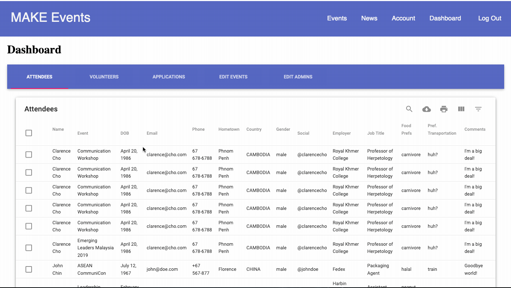

# MAKE Event App

MAKE Event App is a CMS for storing and displaying event data in a central location.

## Demo

[Heroku](https://intense-savannah-19175.herokuapp.com/#/account)

## Prerequisites

Before you get started, make sure you have the following software installed on your computer:

- [Node.js](https://nodejs.org/en/)
- [PostrgeSQL](https://www.postgresql.org/)
- [Nodemon](https://nodemon.io/)

## Setup

1. Fork and clone this repository.

```bash
npm install 
npm run server
npm run client
```
2. Set up a PostgreSQL database using the project's database.sql file.

## Features

### Dashboard



### Filter and Sort Data

### Download Data As Excel File

### Add Event to Calendar


## Contributing
Pull requests are welcome. For major changes, please open an issue first to discuss what you would like to change.

Please make sure to update tests as appropriate.

## License
[MIT](https://choosealicense.com/licenses/mit/)


